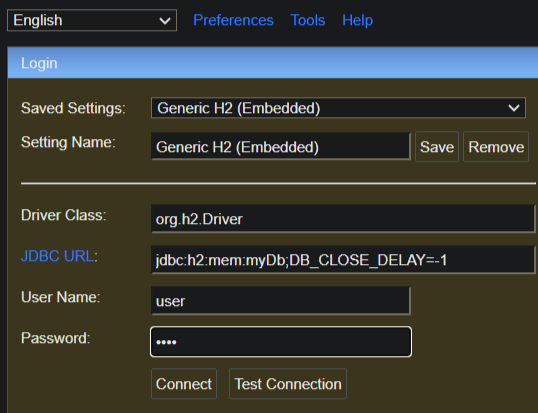
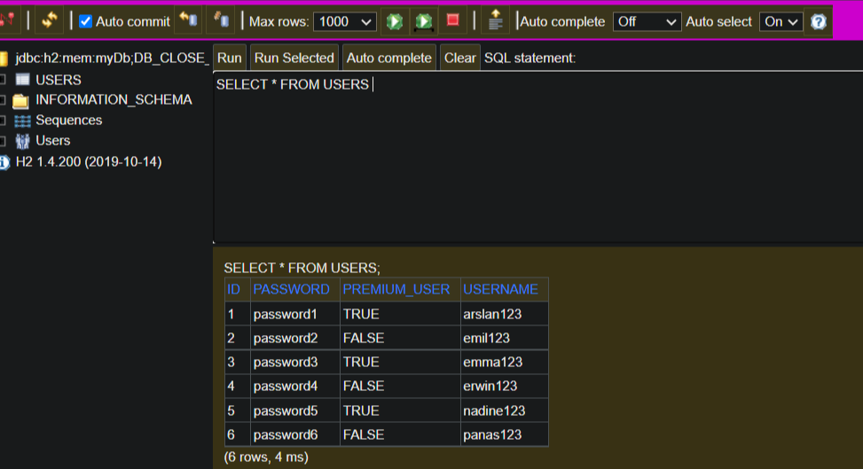
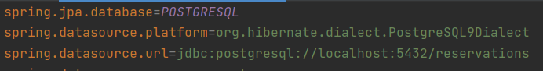
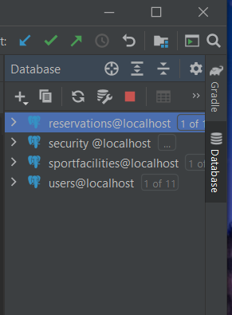
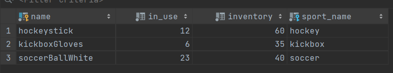

# CSE2115 - SEM Project: Sports Centre Booking System

The aim of this project is to build a backend application for a sports centre.
This system should allow users to:
- register for lessons within the pre-allocated lessons slots (from 9:00 to 16:00)
- reserve the sport fields (e.g., soccer field) and some equipment for the time-slots with no lessons


## Frameworks used 

This application relies on the following tools:
- Back-end framework: `Spring`
    - Communication between server and client: `REST JSON API`
- Database: `H2` for development, `PostgreSQL` for production
    - Communication between server and database: `Hibernate`, `Spring JPA`
- Build automation tool: `Gradle`
- Testing framework: `JUnit 5`
- Code style checker: `CheckStyle`


## Group members (group 25a)

| 📸 | Name | 
|---|---|
|  |   Arslan Bhatti |  
|  |   Emma Wiegers |  
|  |   Emil Malmsten |
|  |   Erwin Li |
|  |   Nadine Kuo |   
|  |   Panagiotis Chatziioannou | 


### Running 
`gradle bootRun`

### Testing
```
gradle test
```

To generate a coverage report:
```
gradle jacocoTestCoverageVerification
```


And
```
gradle jacocoTestReport
```
The coverage report is generated in: build/reports/jacoco/test/html, which does not get pushed to the repo. Open index.html in your browser to see the report. 

### Static analysis
```
gradle checkStyleMain
gradle checkStyleTest
gradle pmdMain
gradle pmdTest
```

### Notes
- You should have a local .gitignore file to make sure that any OS-specific and IDE-specific files do not get pushed to the repo (e.g. .idea). These files do not belong in the .gitignore on the repo.
- If you change the name of the repo to something other than template, you should also edit the build.gradle file.
- You can add issue and merge request templates in the .gitlab folder on your repo.


### Configure database

Before starting the server, you might want to configure your database settings.
We worked with Spring Profiles to switch between H2 for development purposes, and PostgreSQL for production purposes.
This can be done by navigating to `application.properties` and set `spring.profiles.active= ` to either `development` for H2 or `production` for PostgreSQL.
These will invoke the H2Config and PostgresConfig files respectively.
Default is H2 (development).

### H2
Since this is the default Spring profile, you can leave `spring.profiles.active=development` in `application.properties` as it is.
You do have to add a new file under `resources` named `application-dev.properties`. 
Copy the contents of `application-dev.template.properties` file and paste it in this new file. 
Now you only have to enter your username and password still. (default credentials: `user` and `pass`) 

When running any (Eureka client) application (after having started the Eureka server app of course),
you can access this H2 database by going to `http://localhost:<app-port>/h2-console` in your browser.
For our Reservation client app this is `http://localhost:8086/h2-console` e.g.
<br /> 

Here you are expected to enter the same credentials you used in the `application-dev.properties` file. 


After logging in, you can expect to see something like this:



### PostgreSQL
For setting up PostgreSQL, copy the contents of the `application-production.template.properties` file into a new file named `application-production.properties`, again, under `resources`.
Here, your username and password can be added. 
Also, `spring.jpa.hibernate.ddl-auto=` can be set to either `create-drop` or `validate`, causing data to be dropped or preserved respectively after server restart.

When using PostgreSQL, all tables will be inserted into a database whose name is defined in the `application-production.template.properties` file (see below) of the respective microservice (module) you are in. 
For our Reservation microservice, the expected database name is `reservations` for example.



Thus, for each microservice this database will have to be created beforehand (in your terminal).
Then, in IntelliJ you can add all required Postgres data sources, one for each database.



After running any (Eureka client) application that has a database config file in the `config` package, 
Hibernate will insert all dummy values configured into the corresponding database, which should look like this:



Both  `application-dev.properties` and `application-production.properties` are ignored by git, thus database credentials will not be pushed to remote.
